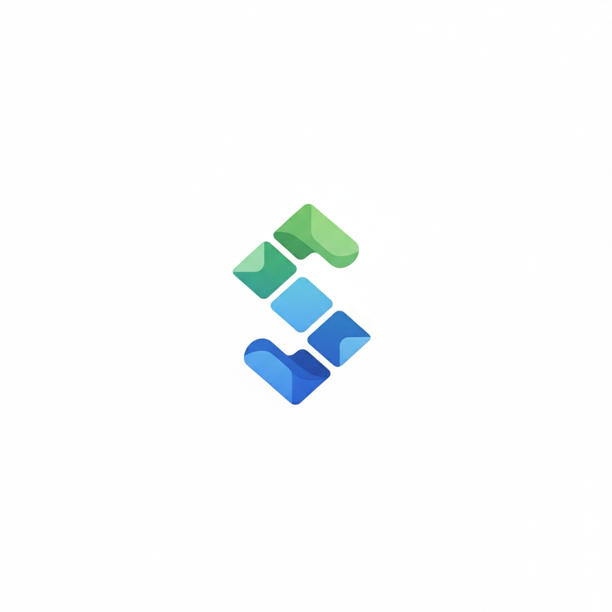

<p align="center">
  
</p>

<h1 align="center">Snipply</h1>

A lightweight, local-first notebook for documentation and code snippets. Built with Next.js (App Router) and Tailwind CSS, featuring a fast Markdown editor with rich extensions and a simple folder-based library.

## ✨ Features

- Folder-based organization with an Unsorted area and drag & drop between folders
- Built-in Markdown editor with:
  - GitHub Flavored Markdown (tables, task lists)
  - Syntax highlighting for code blocks
  - Math via KaTeX (`$…$`, `$$…$$`)
  - Diagrams via Mermaid (```mermaid code fences)
  - Table of contents generation and footnotes
  - Slugged, auto-linked headings for deep-linking
- Client-side persistence (localStorage) — your library is saved automatically
- Responsive layout and dark mode support

## 🧱 Tech Stack

- Next.js 15 (App Router) and React 19
- Tailwind CSS v4
- Zustand for state and persistence
- @uiw/react-md-editor with remark/rehype plugins (GFM, math, footnotes, TOC, KaTeX, highlight, slug, autolink)

## 🚀 Getting Started

Prerequisites: Node.js 18+ (Node 20 recommended) and npm/pnpm/yarn.

1. Install dependencies
   - npm install
2. Start the dev server
   - npm run dev
3. Open http://localhost:3000

No environment variables are required for local development.

## 📁 Project Structure

- `src/app/` — App Router pages, layout, and global styles
- `src/components/` — UI, editor, and sidebars
- `src/store/library.ts` — Zustand store for folders/capsules with persistence
- `public/` — Static assets (logo lives here)

## ✍️ Usage Tips

- Create folders from the right sidebar and drag documents between them
- Click a document (capsule) to edit — changes are saved automatically
- Toggle the editor’s preview/preview-only using the toolbar eye icon
- Mermaid example:
  ```
  ```mermaid
  graph TD
    A[Start] --> B{Choice}
    B -->|Yes| C[Path 1]
    B -->|No| D[Path 2]
  ```
  ```

## 🗺️ Roadmap

- Search across titles/content
- Export/import (Markdown, JSON)
- Share or publish modes
- Cloud sync (optional) and multi-device support

## 📜 License

This project is currently provided for personal use during development. A formal license will be added later.
